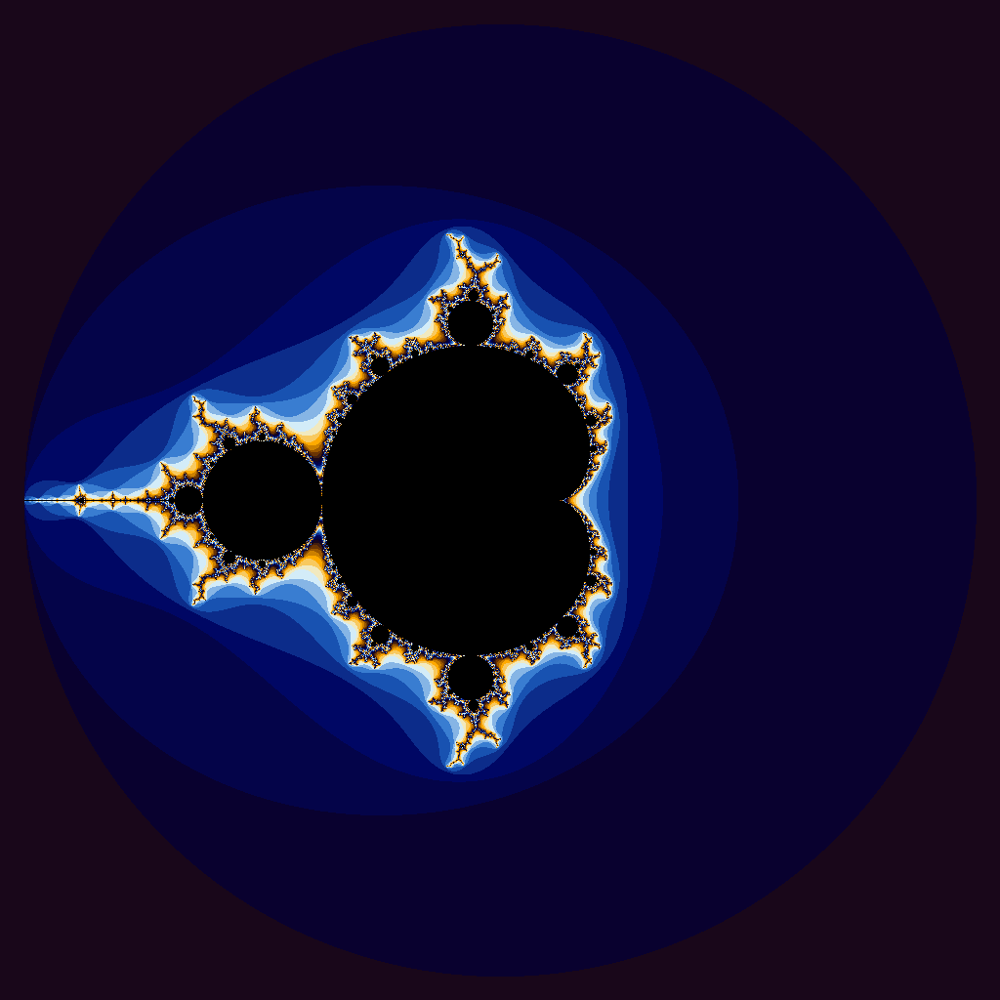
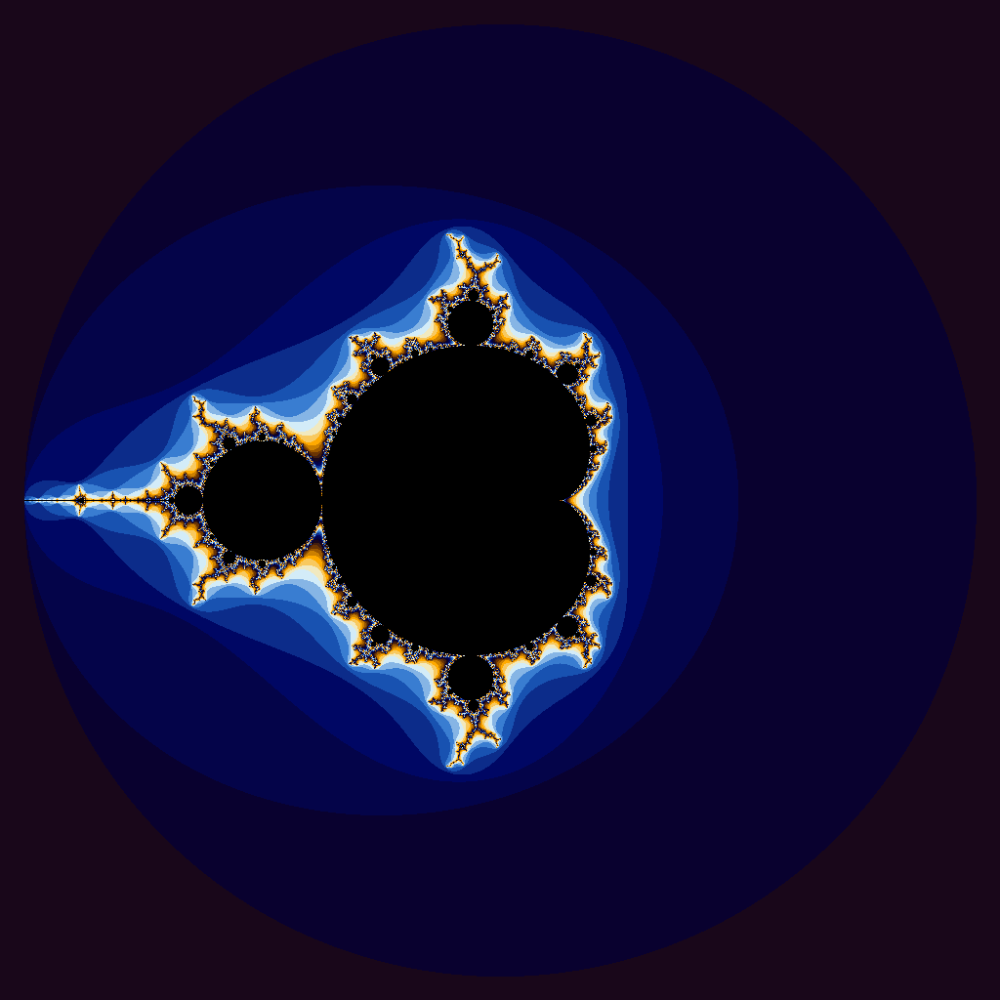

# Project-4
# CPU Version
Uses a for loop to fill a vector with sequential values.
# Results
|Vector Length|Wall Clock Time|User Time|System Time|
|:--:|--:|--:|--:|
|10| 0.00| 0.00| 0.00|
|100| 0.00| 0.00| 0.00|
|1000| 0.00| 0.00| 0.00|
|10000| 0.00| 0.00| 0.00|
|100000| 0.00| 0.00| 0.00|
|1000000| 0.00| 0.00| 0.00|
|5000000| 0.02| 0.00| 0.02|
|100000000| 0.57| 0.08| 0.49|
|500000000| 2.87| 0.44| 2.42|
|1000000000| 5.92| 0.88| 5.03|
|5000000000|36.55| 6.42|30.12|

# CUDA Version
Parellelizes the function. The kernel uses a 1-D grid configuration.
# Results

|Vector Length|Wall Clock Time|User Time|System Time|
|:--:|--:|--:|--:|
|10| 0.29| 0.02| 0.27|
|100| 0.21| 0.01| 0.19|
|1000| 0.21| 0.01| 0.19|
|10000| 0.21| 0.01| 0.19|
|100000| 0.20| 0.00| 0.19|
|1000000| 0.21| 0.01| 0.20|
|5000000| 0.23| 0.01| 0.21|
|100000000| 0.86| 0.17| 0.68|
|500000000| 3.34| 0.77| 2.56|
|1000000000| 6.66| 1.62| 5.03|
|5000000000|46.59| 8.49|38.10|

# Question 1
Q. Are the results what you expected? Speculate as to why it looks like CUDA isn’t a great solution for this problem.
A. The results are relatively close to what I expected. Using a CUDA kernel has a lot of overhead and unless a great amount of work is done to compensate for that overhead, just using the CPU with generally be faster. Since CUDA was slower in this situation, it means that the work done was probably not enough to justify the overhead required by CUDA. Also, there is not very much parellelization needed by iota, so the advantages of CUDA are not very useful for this problem.

# Julia Set Rendered with the CPU

*Starting point: \( z = 0 \), Mandelbrot version*

# Julia Set Rendered with CUDA

*Starting point: \( z = 0 \), Mandelbrot version*

